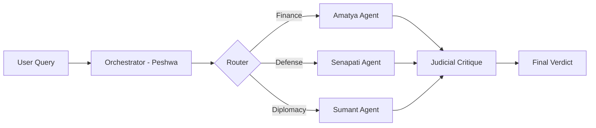

# 👑 Ashta Pradhan AI Council


> **"He who has the wisdom of many, commits the errors of none."**

An advanced **Agentic AI Simulation** that recreates Chhatrapati Shivaji Maharaj's legendary **Council of Eight Ministers** (Ashta Pradhan). 

This application simulates a 17th-century Durbar where a user's query is processed not by a single LLM, but by a coordinated system of specialized AI agents, each representing a specific minister with unique historical "optimization functions" (biases), culminating in a judicial critique and a final Royal Decree.

---

## 🏛️ Project Overview

In the era of Generative AI, we often get a single answer from a single perspective. The **Ashta Pradhan AI Council** solves this by using **Multi-Agent Orchestration**.

When you ask a question (e.g., *"Should we expand trade with the British East India Company?"*):
1. The **Peshwa (Prime Minister)** analyzes the query.
2. He dynamically summons **only the relevant ministers** (e.g., Finance & Foreign Affairs) to the court.
3. Each minister debates the issue based on their specific domain expertise (Revenue vs. Security).
4. The **Nyayadhish (Chief Justice)** cross-examines their advice for ethical or legal conflicts.
5. A **Final Decree** is synthesized and available for download as a Royal Seal PDF.

## ⚙️ Architecture: "The Governance Protocol"

This project utilizes a **Router-Solver-Critic** architecture powered by **Google Gemini 3.0**.



1.  **Historical RAG (Retrieval Augmented Generation):** The system first queries the *Adnyapatra* (Royal Edict) and historical archives to ground the context.
2.  **Intelligent Routing:** The Peshwa agent determines which of the 8 ministers are required.
3.  **Parallel Deliberation:** Selected agents run in parallel (using `gemini-3-flash-preview`) to generate domain-specific advice.
4.  **Judicial Review:** The Nyayadhish agent (using `gemini-3-pro-preview`) critiques the advice, looking for risks or contradictions.
5.  **Synthesis:** The final verdict balances all viewpoints into an actionable decree.

## 👥 The Council Agents

Each agent is prompted with a specific personality and **Optimization Function**:

| Agent Role | Title | Optimization Function (Bias) |
| :--- | :--- | :--- |
| **Peshwa** | Prime Minister | Balance (Utility vs Risk) |
| **Amatya** | Finance Minister | Cost Efficiency & ROI |
| **Senapati** | Commander-in-Chief | Operational Feasibility & Speed |
| **Sachiv** | Secretary | Bureaucratic Order & QA |
| **Mantri** | Home Minister | Historical Precedent & Intelligence |
| **Sumant** | Foreign Minister | External Perception & Geopolitics |
| **Panditrao** | High Priest | Culture, Ethics & Morale |
| **Nyayadhish** | Chief Justice | Legal Compliance & Justice |

## 🛠️ Tech Stack

*   **Frontend:** React 19, TypeScript
*   **Styling:** Tailwind CSS (Dark, Historical Aesthetic)
*   **AI Model:** Google Gemini API (`gemini-3-flash-preview` & `gemini-3-pro-preview`)
*   **Architecture:** Client-side LangGraph-inspired Agentic Workflow
*   **Icons:** Lucide React
*   **PDF Generation:** jsPDF

## 🚀 Getting Started

### Prerequisites
*   Node.js (v18+)
*   A Google Gemini API Key

### Installation

1.  **Clone the repository**
    ```bash
    git clone https://github.com/yourusername/ashta-pradhan-ai.git
    cd ashta-pradhan-ai
    ```

2.  **Install Dependencies**
    ```bash
    npm install
    ```

3.  **Set Environment Variables**
    Create a `.env` file in the root directory:
    ```env
    VITE_API_KEY=your_google_gemini_api_key_here
    ```

4.  **Run the Simulation**
    ```bash
    npm run dev
    ```

## 📸 Screenshots

### The Landing Page
*A cinematic entry point introducing the Council.*

### The Durbar (Simulation)
*Real-time visualization of the Router deciding which agents to summon.*

## 📄 License

This project is open-source and available under the [MIT License](LICENSE).

---

*Built with 🧡 by Rakesh Telang*